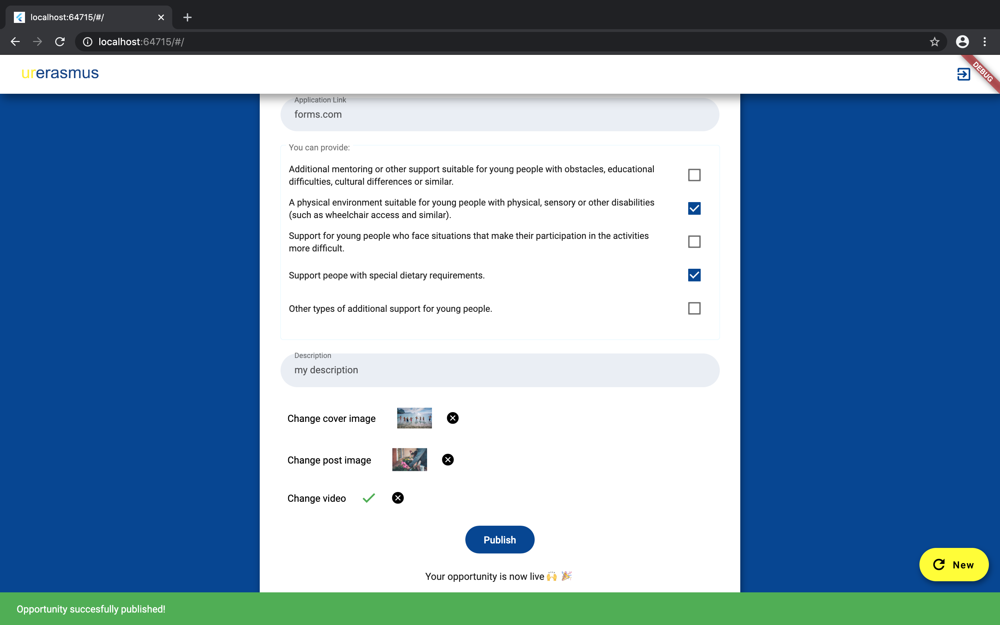
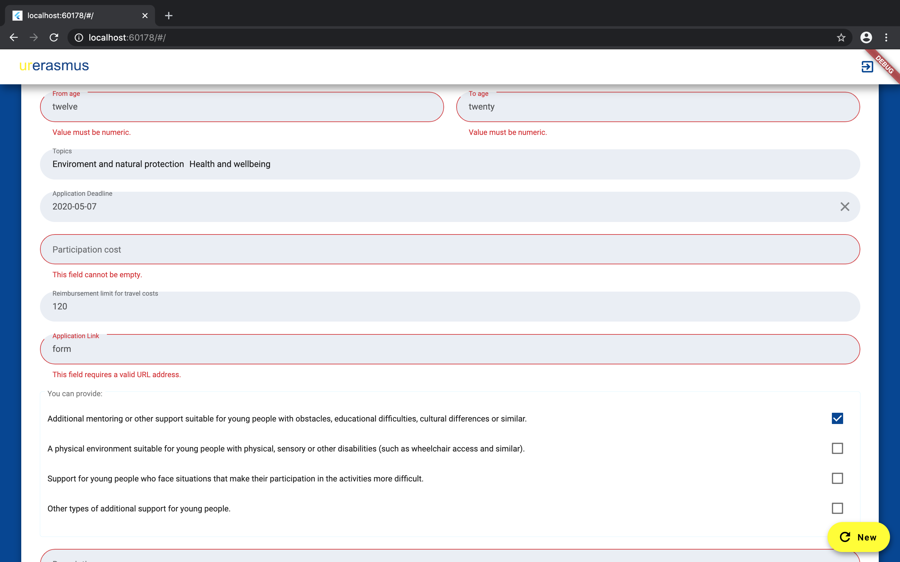

# Erasmus Opportunities - Website

This website was created for organisations to post opportunities for [erasmus-opportunities-mobile-app](https://github.com/argyrogounari/erasmus-opportunities-mobile-app).

### Onboarding

### Opportunity Form Filling

Open source libraries used:

- [flutter_login 1.0.14](https://pub.dev/packages/flutter_login)
- [flutter_multiselect 0.4.0](https://pub.dev/packages/flutter_multiselect#-readme-tab-)
- [transformer_page_view 0.1.6](https://pub.dev/packages/transformer_page_view)
- [flushbar 1.10.2](https://pub.dev/packages/flushbar)
- [image_picker_web 1.0.8](https://pub.dev/packages/image_picker_web)
- [flip_card 0.4.4](https://pub.dev/packages/flip_card)
- [flutter_form_builder 3.9.0](https://pub.dev/packages/flutter_form_builder)
- [flutter_progress_button 1.0.0](https://pub.dev/packages/flutter_progress_button)
